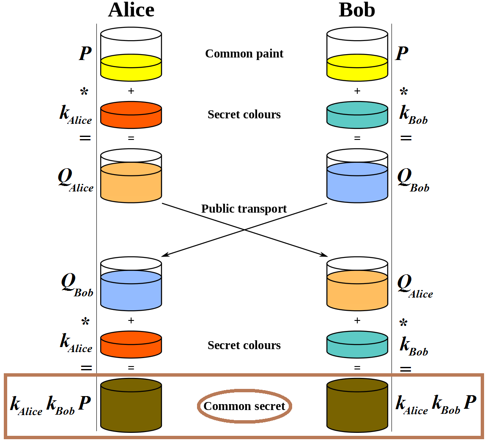
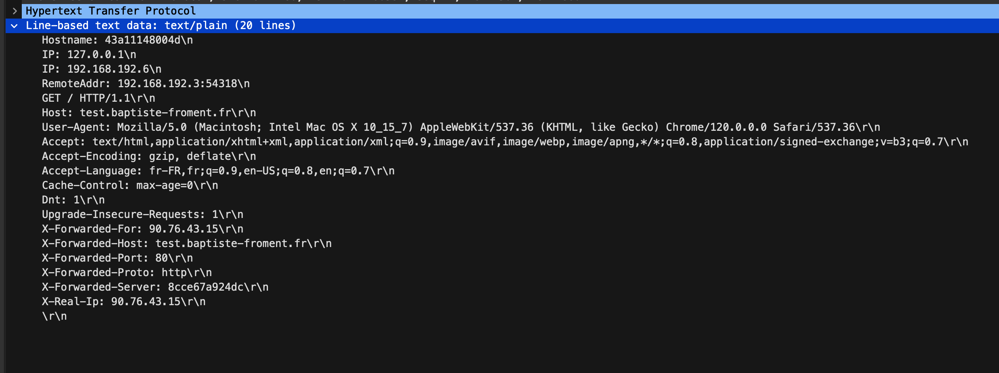

# Présentation du protocole HTTPS

## Sommaire

1. [Introduction](#introduction)
2. [Le protocole TLS](#le-protocole-tls)
    1. [Présentation du protocole TLS](#présentation-du-protocole-tls)
    2. [Fonctionnement du protocole TLS](#fonctionnement-du-protocole-tls)
3. [Diffie-Hellman](#diffie-hellman)
    1. [Principe de Diffie-Hellman en image](#principe-de-diffie-hellman-en-image)
4. [Suivi des trames HTTPS vs HTTP](#suivi-des-trames-https-vs-http)
    1. [HTTPS](#https)
        1. [Envoie Client Hello](#envoie-client-hello)
        2. [Reçoit Server Hello](#reçoit-server-hello)
        3. [Reçoit le certificat du serveur](#reçoit-le-certificat-du-serveur)
        4. [Echange de clé](#echange-de-clé)
        5. [Server Hello Done](#server-hello-done)
    2. [HTTP](#http)
5. [Conclusion](#conclusion)

## Introduction


Les entreprises et les applications web ont de bonnes raisons d'utiliser le protocole TLS, car il contribue à protéger contre les violations de données et d'autres attaques. Les sites web utilisant le HTTPS, qui est protégé par TLS, sont devenus la norme, et les navigateurs modernes avertissent les utilisateurs des sites non HTTPS, ce qui renforce la confiance des internautes.
Le HTTPS, quant à lui, est une implémentation du chiffrement TLS en surcouche du protocole HTTP utilisé par les sites web. Ainsi, tout site web utilisant le HTTPS repose sur le chiffrement TLS pour sécuriser les données en transit.

## Le protocole TLS

### Présentation du protocole TLS

La Transport Layer Security (TLS), anciennement connue sous le nom de Secure Sockets Layer (SSL), est un ensemble de protocoles de sécurité utilisés pour sécuriser les communications sur les réseaux informatiques, en particulier sur Internet. Le protocole SSL a été initialement développé par Netscape Communications Corporation pour sécuriser les communications via son navigateur web. Plus tard, l'Internet Engineering Task Force (IETF) a repris le développement du protocole en le renommant TLS. Les termes SSL et TLS sont souvent utilisés de manière interchangeable.

Parler de "certificat SSL" de nos jours est un abus de langage. Bien que le terme "SSL" ait été largement utilisé par le passé pour désigner les certificats de sécurité numérique utilisés pour activer la couche de chiffrement dans les protocoles de sécurité sur Internet, en réalité, ces certificats sont désormais associés à TLS qui est la norme de sécurité pour les communications sur Internet depuis l’apparition de TLS 1.0 en 1999.


La TLS (ou SSL) fonctionne en mode client-serveur et vise à assurer les objectifs de sécurité suivants :
1. Authentification du serveur.
2. Confidentialité des données échangées grâce à la création d'une session chiffrée.
3. Intégrité des données échangées.
4. Éventuellement, l'authentification du client, bien que celle-ci soit généralement gérée au niveau de la couche applicative.

L'utilisation de TLS a considérablement renforcé la sécurité des transactions en ligne, telles que les paiements par carte bancaire, en empêchant les tiers d'intercepter des données sensibles transitant sur le réseau. Bien que le système de chiffrement ne soit pas infaillible, son adoption répandue par de nombreuses banques et sites de commerce électronique témoigne de son efficacité dans la protection des transactions des utilisateurs.

TLS est couramment reconnaissable par l'ajout du préfixe "https://" dans l'URL du site web, ainsi que par l'affichage d'un cadenas ou d'une icône de sécurité dans le navigateur web.

En plus de son utilisation dans le commerce électronique, TLS est également largement utilisé dans les réseaux industriels modernes pour sécuriser les communications.

Les performances des applications web ne sont généralement pas affectées par les dernières versions du TLS. Bien que la négociation TLS puisse nécessiter un certain temps de chargement et de la puissance de calcul en raison de sa complexité, des technologies comme le TLS False Start et la TLS Session Resumption ont été développées pour réduire la latence et rendre le protocole plus rapide. En fin de compte, le TLS est devenu un protocole rapide et efficace, et les coûts de calcul associés sont généralement négligeables par rapport aux normes actuelles. La version TLS 1.3, en particulier, a rendu le processus encore plus rapide en réduisant le nombre d'allers-retours nécessaires lors de la négociation.

Ces certificats sont délivrés par des autorités de certification et contiennent des informations cruciales sur l'entité propriétaire du domaine et la clé publique du serveur pour valider son identité.

### Fonctionnement du protocole TLS

TLS fonctionne en utilisant un mélange de chiffrement asymétrique, comme le chiffrement RSA, pour établir un secret partagé, et de chiffrement symétrique, comme l'AES, pour chiffrer les données échangées. La sécurité est renforcée par l'utilisation de fonctions de hachage, telles que SHA-1, pour garantir l'intégrité et l'authenticité des données.


Le TLS agit en initiants des négociations TLS, ou "handshake TLS", lorsqu'un utilisateur accède à un site web protégé par ce protocole. Au cours de cette négociation, les appareils client et serveur définissent des paramètres tels que la version de TLS, les suites de chiffrement, et ils authentifient le serveur grâce à son certificat TLS. Ensuite, ils génèrent des clés de session pour chiffrer les données de manière sécurisée.

Processus du Handshake :

 - Client Hello
 - Server Hello
 - Certificats envoyé par le serveur
 - Echange de clés avec la méthode Diffie-Hellman

Le handshake désigne le processus qui amorce une session de communication en utilisant le chiffrement TLS. Durant cette négociation, les deux parties s’échangent des messages d’authentification et de vérification. Elles établissent également les algorithmes de chiffrement qu’elles utiliseront. De plus, les deux parties se mettent d’accord sur les clés de session.

La négociation intervient chaque fois qu’un utilisateur accède à un site web via HTTPS, le navigateur interroge le serveur d’origine du site web.
Il intervient aussi sur d’autre communication comme les appels api et les requêtes DNS sur HTTPS.

Au cours d’une négociation, le client et le serveur effectuent ensemble les opérations suivantes : 

Préciser la version TLS, décider de la suite de chiffrement, authentifier l’identité du serveur à l’aide de la clé publique et de la signature numérique du certificat.

Enfin, les clés de session afin d’utiliser le chiffrement symétrique une fois la négociation terminée.

Authentification : le client vérifie le certificat TSL du serveur auprès de l'autorité de certification qui l'a émis. Cette opération confirme que le serveur est bien celui qu'il prétend être et que le client interagit avec le véritable propriétaire du domaine.

Secret pré-maître : le client envoie une autre chaîne d'octets aléatoire, le « premaster secret », ou secret pré-maître. Le secret pré-maître est chiffré à l'aide de la clé publique et ne peut être déchiffré par le serveur qu'avec la clé privée. (Le client obtient la clé publique dans le certificat SSL du serveur.)

Utilisation de la clé privée : le serveur déchiffre le secret pré-maître.

Création des clés de session : le client et le serveur génèrent des clés de session à partir du client random, du server random et du secret pré-maître. Ils doivent aboutir aux mêmes résultats.

Client prêt : le client envoie un message « Client Finished » chiffré à l'aide d'une clé de session.

Serveur prêt : le serveur envoie un message « Server Finished » chiffré à l'aide d'une clé de session.
Chiffrement symétrique sécurisé effectué : la négociation est terminée et la communication se poursuit à l'aide des clés de session.

## Diffie-Hellman

Afin de mettre en place une communication sécurisée, il faut que les deux parties puissent s’échanger des informations de manière sécurisée. Pour cela, il faut que les deux parties puissent s’échanger une clé secrète. Cependant, il est impossible de s’échanger une clé secrète de manière sécurisée. En effet, si on l’envoie en clair, un attaquant peut l’intercepter. Si on l’envoie chiffrée, il faut une clé pour chiffrer la clé secrète, et cette clé doit être envoyée en clair. Il faut donc trouver un moyen de s’échanger une clé secrète sans l’envoyer en clair ni avoir besoin d’une clé pour la chiffrer. C’est ce que permet l’échange de clé Diffie-Hellman. Il permet à deux parties de s’échanger une clé secrète sans avoir besoin de s’échanger une clé pour la chiffrer. Cet échange de clé se fait en deux étapes : l’échange de clé et la génération de la clé secrète.

En premier lieu, les deux parties s’échangent des informations publiques. Ces informations sont des nombres premiers et des générateurs. Ces nombres premiers et générateurs sont choisis par les deux parties. Ils sont publics et peuvent être connus de tous. Les deux parties s’échangent également des nombres aléatoires.

Une fois que les deux parties ont échangé leurs informations publiques et leurs nombres aléatoires, elles peuvent générer une clé secrète. Pour cela, elles utilisent les nombres premiers, les générateurs et les nombres aléatoires. Elles effectuent des calculs sur ces nombres et obtiennent une clé secrète. Cette clé secrète est la même pour les deux parties. Elle est donc connue des deux parties. Cependant, elle n’est pas connue des autres. En effet, les nombres premiers et les générateurs sont publics, mais les nombres aléatoires sont privés. Il est donc impossible de retrouver la clé secrète à partir des nombres premiers et des générateurs.

### Principe de Diffie-Hellman en image



Maintenant que la clé secrète a été générée et connue des deux parties, ils peuvent s’échanger des messages de manière sécurisée. En effet, ils peuvent s'échanger des informations chiffrées de manière symétrique grâce à cette clé secrète connu d'eux seul et sans que personne n'ait pu l'intercepter.

A noter que pour s'assurer que l'on communique bien avec la bonne personne, il faut que les deux parties s'authentifient. Pour cela, elles utilisent des certificats. Ces certificats sont des fichiers qui contiennent des informations sur la personne qui communique. Ces informations sont signées par une autorité de certification. Cette autorité de certification est une entité de confiance. Elle est connue de tous et est capable de vérifier l'identité de la personne qui communique. Ainsi, si une personne communique avec une autre, elle peut vérifier l'identité de cette personne grâce à son certificat. Pour cela, elle vérifie que le certificat est signé par une autorité de certification de confiance. Si c'est le cas, elle peut vérifier l'identité de la personne qui communique. Si ce n'est pas le cas, elle ne peut pas vérifier l'identité de la personne qui communique.

## Suivi des trames HTTPS vs HTTP

### HTTPS

#### Envoie Client Hello

 - protocol version
    - TLS 1.2
 - client random data (used later in the handshake)
    - f1d16.....
 - an optional session id to resume
    - 00d5.....
 - list of cipher suites
    - see screen

#### Reçoit Server Hello

- on se met d'accord sur le protocol version
    - TLS 1.2
- server random data (used later in the handshake)
    - 4e45...
- session id
    - 00d5...
- cipher suite chosen
    - TLS_AES_128_GCM_SHA256

#### Reçoit le certificat du serveur


Dans la capture Wireshark, nous observons un message "Certificate" du protocole de poignée de main TLS, essentiel pour authentifier la communication sécurisée. Ce message, de type "Certificate" et d'une longueur totale de 3936 octets, contient des certificats numériques émis par le serveur. Le premier certificat, long de 2471 octets, est crucial pour établir l'identité du serveur. Il détaille la version du certificat (v3), le numéro de série unique, et utilise l'algorithme `sha384WithRSAEncryption` pour la signature. Il inclut également des informations sur l'émetteur, le sujet du certificat, et les détails de la clé publique RSA. Les extensions fournissent des informations supplémentaires. Un second certificat, plus court mais structuré de manière similaire, est également présent.

```txt
Handshake Protocol: Certificate
            Handshake Type: Certificate (11)
            Length: 3936
            Certificates Length: 3933
            Certificates (3933 bytes)
                Certificate Length: 2471
                Certificate [truncated]: 308209a33082078ba00302010202133300116ec089503c655b7ad27b000000116ec0300d06092a864886f70d01010c0500305d310b3009060355040613025553311e301c060355040a13154d6963726f736f667420436f72706f726174696f6e312e302c06035504031325
                    signedCertificate
                        version: v3 (2)
                        serialNumber: 0x3300116ec089503c655b7ad27b000000116ec0
                        signature (sha384WithRSAEncryption)
                            Algorithm Id: 1.2.840.113549.1.1.12 (sha384WithRSAEncryption)
                        issuer: rdnSequence (0)
                        validity
                        subject: rdnSequence (0)
                        subjectPublicKeyInfo
                            algorithm (rsaEncryption)
                                Algorithm Id: 1.2.840.113549.1.1.1 (rsaEncryption)
                            subjectPublicKey [truncated]: 3082010a0282010100b9c7c5987c3eaa6b965da1c94eeaeca563d2af9a0fae33895e5750a813db504f16b13a4d01aa88a6adce25bceff8f7a118e4bfda05859625d1bb1196305038b1e2e266c17d0a99eae27e23582aa9c554215cdf20c632f3aa294290323fe2bd6
                                modulus: 0x00b9c7c5987c3eaa6b965da1c94eeaeca563d2af9a0fae33895e5750a813db504f16b13a…
                                publicExponent: 65537
                        extensions: 12 items
                    algorithmIdentifier (sha384WithRSAEncryption)
                        Algorithm Id: 1.2.840.113549.1.1.12 (sha384WithRSAEncryption)
                    Padding: 0
                    encrypted [truncated]: 7a6bbce1cf6236ea64bbaa4979682b1f739e5870e1e65cc967fdb74b3c582a0b4e12e28ee561403b0c69e324b6735d546f611833cafae87eb54b6482b314758bf1612db3f87f01bf8a141dd43773af79c3997b0d66b4064b7faffb0b72f670390a6635005466561349e67cd7
                Certificate Length: 1456
                Certificate [truncated]: 308205ac30820494a00302010202100a43a9509b01352f899579ec7208ba50300d06092a864886f70d01010c05003061310b300906035504061302555331153013060355040a130c446967694365727420496e6331193017060355040b13107777772e6469676963657274
```

#### Echange de clé

Le serveur et le client s'échangent leur clé. La courbe elliptique employée est la secp384r1, une norme répandue pour définir les paramètres de la clé publique dans de telles transactions. Le serveur, dans ce processus, transmet sa clé publique, un élément indispensable pour un échange de clés sécurisé entre les parties. Pour garantir l'authenticité et l'intégrité du message, le serveur utilise un mécanisme de signature, le RSA-PSS avec SHA-256. 
```txt
Handshake Protocol: Server Key Exchange
            Handshake Type: Server Key Exchange (12)
            Length: 361
            EC Diffie-Hellman Server Params
                Curve Type: named_curve (0x03)
                Named Curve: secp384r1 (0x0018)
                Pubkey Length: 97
                Pubkey: 049bad14ec05437e7eebfdb089b6bc2aa0c94188fef8e0222ee8742de48044d793d314f7ae46c1aae9a3933d3495b6735bb777bd108bf2ff9b8d107c4f888c17b93d24a4ed7d067f56f3ec52838f4a9ba720664c8d4edc2cabce64f3ba21878141
                Signature Algorithm: rsa_pss_rsae_sha256 (0x0804)
                Signature Length: 256
                Signature [truncated]: 2cd6db5b0adb49a1c77891bf0d55385c9e77a12fa2b3d87b10261209312cb45cfd4eb1f179432f10f31e1a49cbf40afe980ff7302f769c726b47ab4ebcd2183d3fcdc3ac2a900095df666bbeeff74bc1610813bc264fdc12c531fc292b83579854f786721edf45c77a8ac9a3
```

#### Server Hello Done

Une fois que le serveur a envoyé son certificat, il envoie un message Server Hello Done. Ce message indique au client qu'il a terminé la négociation et qu'il attend une réponse du client. Le client peut alors vérifier le certificat du serveur et envoyer son propre certificat si le serveur l'exige.

```txt
Handshake Protocol: Server Hello Done
    Handshake Type: Server Hello Done (14)
    Length: 0
```
### HTTP

Quand on consulte le site : [http://test.baptiste-froment.fr ](http://test.baptiste-froment.fr)


Ici on voit que l'on envoie une requête en clair et que l'on reçoit une réponse en clair.
Les informations ici ne sont pas sensibles, mais si on avait envoyé un mot de passe, il aurait été possible de le récupérer.
## Conclusion

La compréhension approfondie des protocoles HTTPS et TLS, ainsi que le mécanisme d'échange de clés Diffie-Hellman, révèle leur importance fondamentale dans la sécurisation des communications sur Internet. La transition de SSL à TLS marque une évolution significative dans la cybersécurité, offrant une protection renforcée contre des menaces en constante évolution.

La mise en œuvre de TLS dans le protocole HTTPS garantit l'authentification, la confidentialité et l'intégrité des données, formant un bouclier contre les interceptions et les modifications non autorisées. Cette technologie est particulièrement cruciale pour les transactions en ligne et les communications d'entreprise. Les améliorations continues, notamment avec l'introduction de TLS 1.3, ont optimisé le protocole en termes de rapidité et d'efficacité, atténuant les préoccupations relatives aux performances.

La distinction entre les protocoles HTTP et HTTPS, comme le montrent les analyses de trafic, souligne la vulnérabilité du premier et la robustesse du second. HTTPS, avec son processus de chiffrement et de négociation, se présente comme un rempart efficace contre les écoutes et les attaques de type "man-in-the-middle".

En regardant vers l'avenir, il est essentiel de continuer à promouvoir l'utilisation du HTTPS pour tous les sites web, en particulier ceux gérant des données sensibles. La sensibilisation à l'importance de la sécurité numérique doit être renforcée auprès du grand public et des entreprises. De plus, l'évolution continue des normes de sécurité Internet, y compris des politiques plus strictes pour les autorités de certification et les algorithmes de chiffrement, est nécessaire pour maintenir et renforcer la confiance dans les transactions en ligne.

## Bibliographie

https://tls12.xargs.org/#server-encryption-keys-calculation

https://blog.hartleybrody.com/https-certificates/

https://www.twaino.com/definition/h/https/
